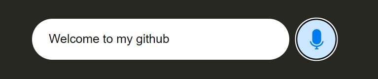

<!-- README.md -->

<!-- # voice_recognition -->
<h1 style="color: blue;">voice_recognition</h1>
<!-- copy yourself 2 files -->

- index.html
- index.js

after launch, press the microphone button and you can talk

  

the result will be displayed in a field on the screen and in the console

  

## I wish you good use of this code in your projects! 🚀
